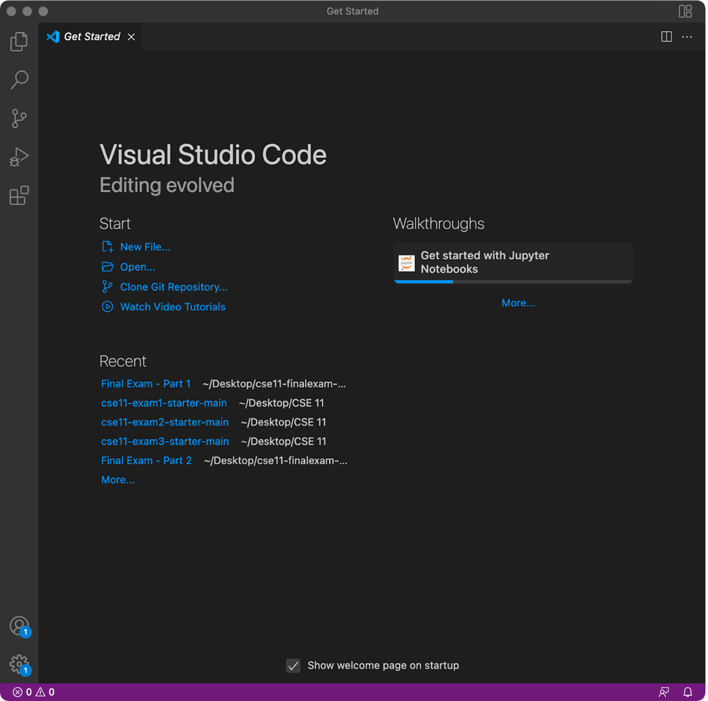
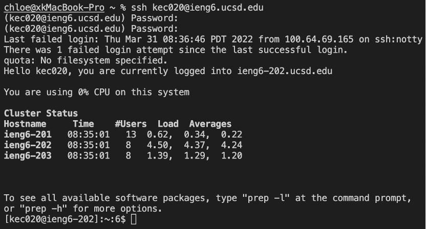
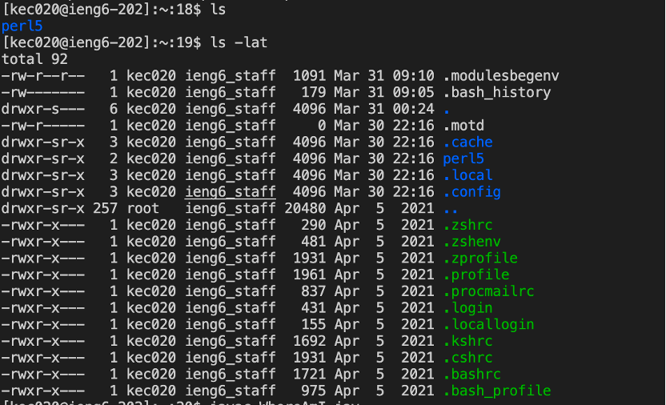
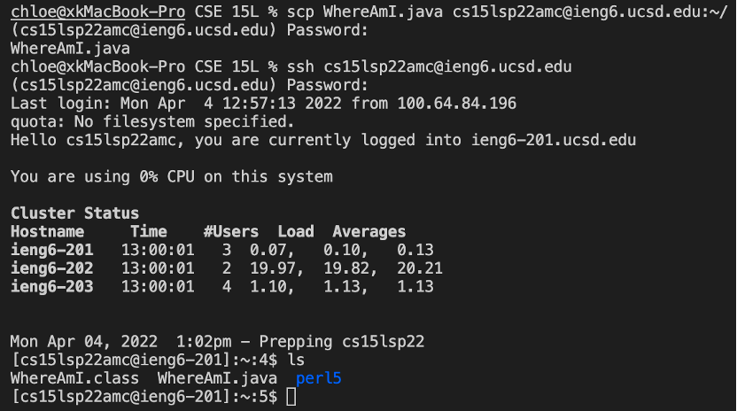
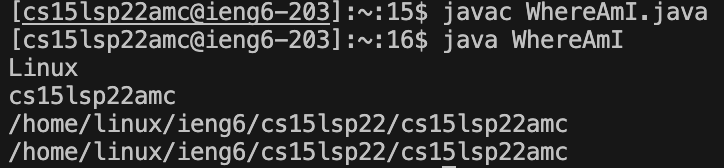
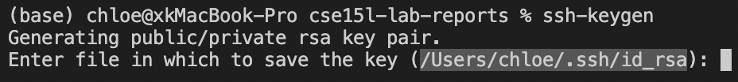
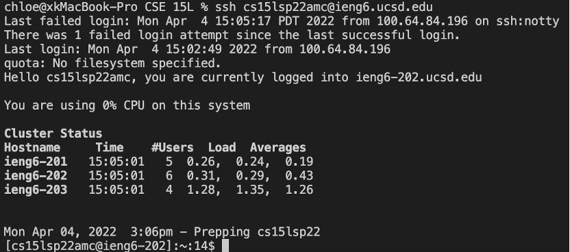
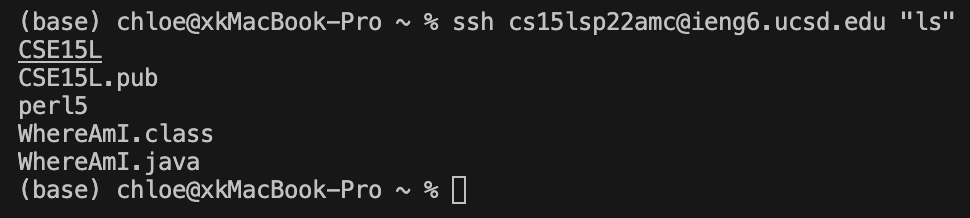
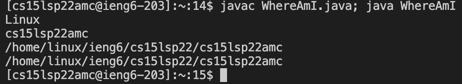

# Lab Report
## Installing VScode
First, go to this [link](https://code.visualstudio.com/download) and follow the installation instruction to download Visual Studio Code.
Once you download and open it successfully, you can see the page.


## Remotely Connecting
In order to connect to a remote host, fist we need to know our course-specific account for CSE 15L from the [link](https://sdacs.ucsd.edu/~icc/index.php).

Then open the terminal in VSCode, type `ssh` and your account after `ssh`, like this: (where you need to replace *amc* into the letters in your course-specific account.)

`ssh cs15lsp22amc@ieng6.ucsd.edu`

Type *yes* and press enter when you first connect to the server. Once you successfully connect to the server, you will see: 

Since this is not my first time, I do not need to type *yes* after I give my password. 


## Trying some commands
We can try some commands in our terminal. Here is the commands I tried in my terminal. 


## Moving Files with scp
First, go back to your local computer. 

You can do: 

either log out of the remote server in your terminal by using:

* Ctrl-D
* Run the command exit

or open a new terminal in VSCode.

Then, create a file called *WhereAmI.java*, and put the following content into it:
```
class WhereAmI {
  public static void main(String[] args) {
    System.out.println(System.getProperty("os.name"));
    System.out.println(System.getProperty("user.name"));
    System.out.println(System.getProperty("user.home"));
    System.out.println(System.getProperty("user.dir"));
  }
}
```
Then run the command in the terminal (where you need to replace *amc* into the letters in your course-specific account), and enter the password.

`scp WhereAmI.java cs15lsp22amc@ieng6.ucsd.edu:~/`

Then, you can log into ieng6 with `ssh`, and run the `ls` command in your terminal. You will see the *WhereAmI.java* file in your home directory. Now you can run it on ieng6 computer using `javac` and `java`. Here is the example:
 



## Setting an SSH Key
Since typing the password every time we log in or run `scp` is annoying and time-consuming, we can use the `ssh` keys (`ssh-keygen`) to avoid this repetitive task.

The `ssh-keyen` helps to create a pair of files called *public key* and *private key*. You copy the public key on the server and the private key on the client. Then the `ssh` command can use the files to replace your password.

First, on client(your local computer), run: 

`ssh-keygen`

You will see: 


Copy and paste the highlighted words. Then you will see:

`Enter passphrase (empty for no passphrase):`

**Note: Do not add a passphrase for this step**, just press enterto skip this step.

The private key will be in the file *id_rsa* and the public key will be in the file *id_rsa.pub*. Both of them will be stored in the *.ssh* directory on the client.

Then log into the igen6 account, and copy the public key to the *.ssh* directory on the server 

you will write the following commands:

`ssh cs15lsp22amc@ieng6.ucsd.edu` (then enter the password)

`mkdir .ssh`

`Ctrl-D` to log out of the account.

`scp /Users/<user-name>/.ssh/id_rsa.pub cs15lsp22amc@ieng6.ucsd.edu:~/.ssh/authorized_keys`

Once you've done this, you will be able to log in with `ssh` or use `scp` without entering the password, like this:



## Optimizing Remote Running

* You can write a command in quote after the `ssh` command to directly run it in the server. Here is the example:


* You can use semicolons to run multiple commands on the same line. For example:


* You can use the up-arrow to recall the last command was run.
