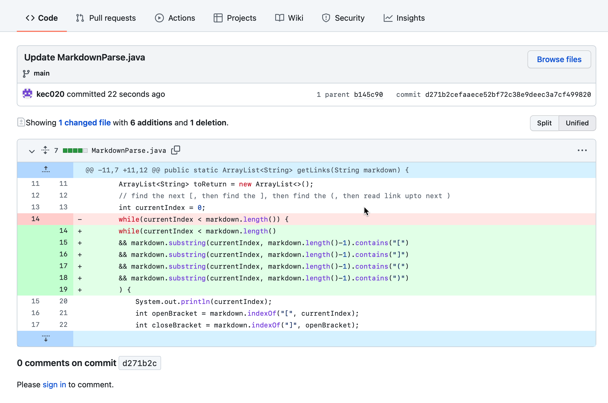
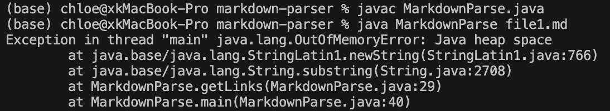
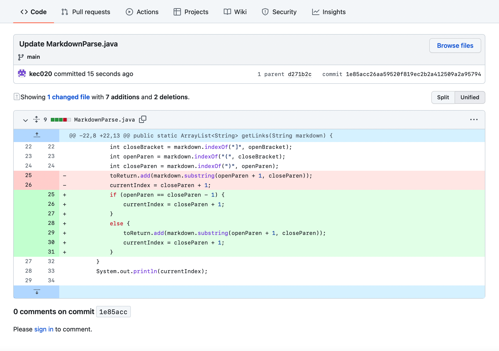
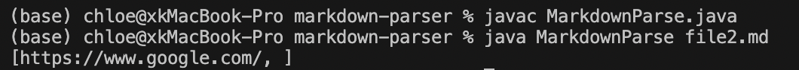
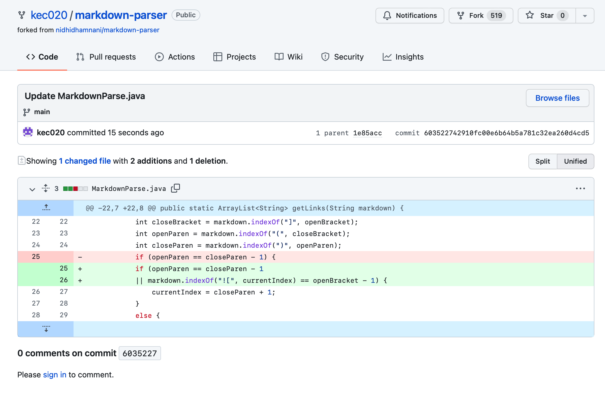
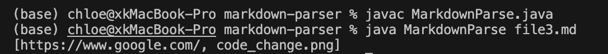

# Lab Report 2

## First change:

[test file1](https://github.com/kec020/markdown-parser/blob/main/file1.md)

The first bug is that the getLinks method cannot stop if the file doesn't end with the close parenthesis ")". I wrote a test file that end with "(", which is a *failure-inducing input*, and the symptom turned out to be OutOfMemoryError. This is because the program cannot stop and it runs out of memory. Therefore I added some if statements to stop the while loop.

## Second change:

[test file2](https://github.com/kec020/markdown-parser/blob/main/file2.md)

The second bug is that when there is no link between the open parenthesis and close parenthesis, the output should not print the blank link. So I wrote the second test file, in which one file has no links. This is a *failure-inducing input*. The symptom is that there is an extra comma "," following with nothing after the first link. 

## Third change:

[test file3](https://github.com/kec020/markdown-parser/blob/main/file3.md)

The third bug is that the getLinks method should not print out the image reference. So I wrote the third test file, where one file has an image reference. The symptom is that the output prints both the file link and an image reference.