# Lab Report 3

## 1. Streamlining ssh configuration

This is my `.ssh/config` file.

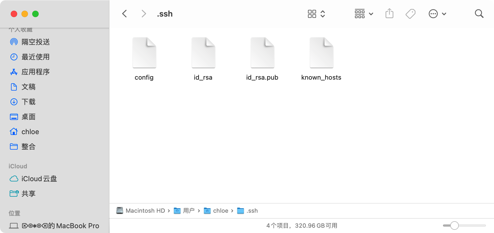

This is how I edited it.

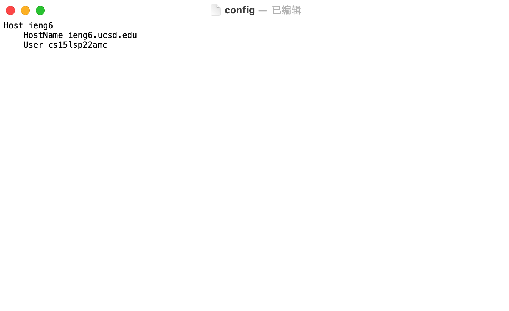

This is the `ssh` command logging me into my account using just the alias I chose.

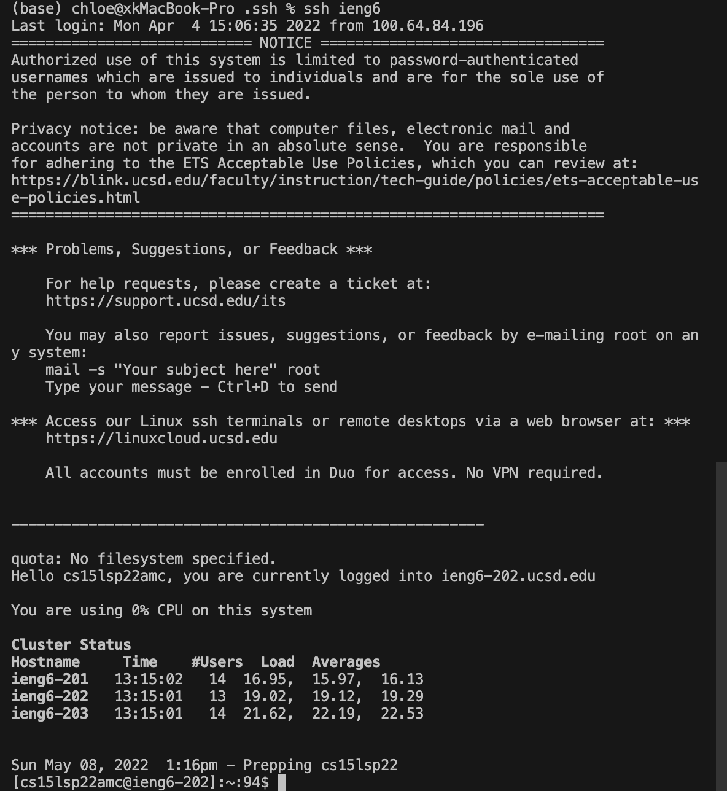

This is how I use an `scp` command copying a file to my account using just the alias I chose.

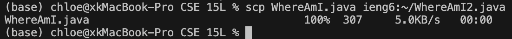

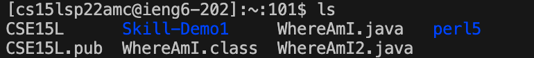

## 2. Setup Github Access from ieng6

This is the public key I stored on GitHub.

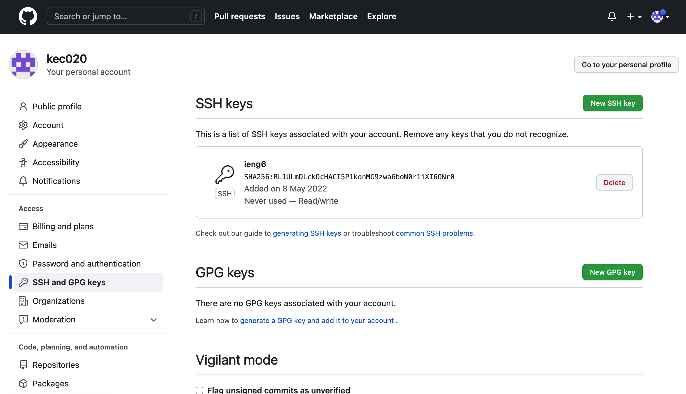

Here are both the public key and private key that I stored on my user account.

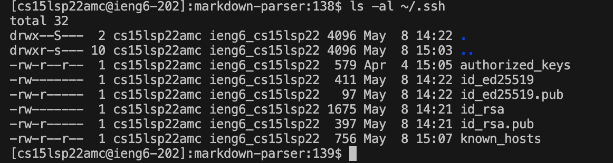

Show running git commands to commit and push a change to Github while logged into my ieng6 account.

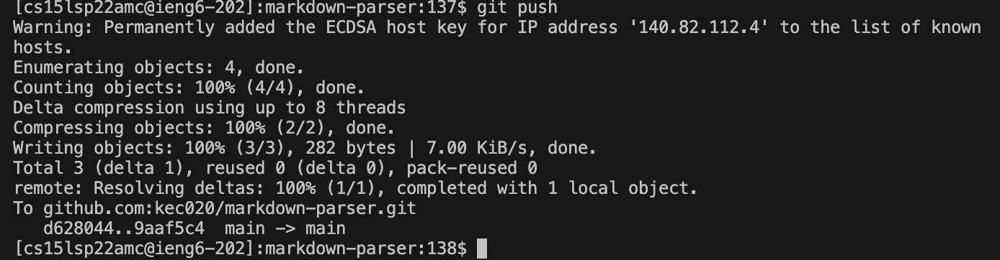

This a link for the resulting commit.

[link](https://github.com/kec020/markdown-parser/commits/main/new_file.md)

## 3. Copy whole directories with scp -r

This is how I copied my whole markdown-parse directory to my ieng6 account

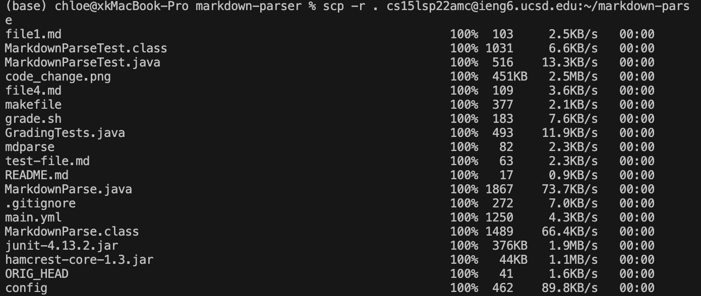

This is how I logged in the ieng6 account.

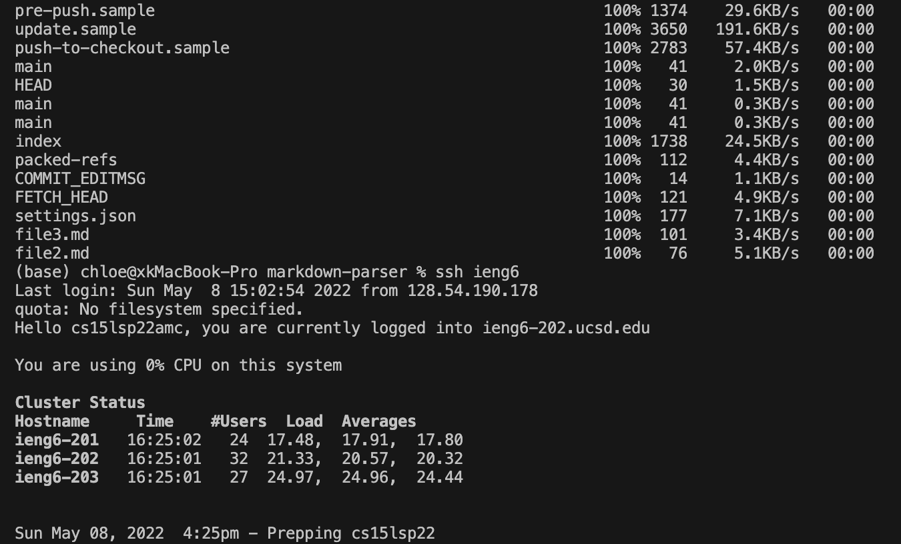

This is how I compile and run the tests.

This is the combined step:

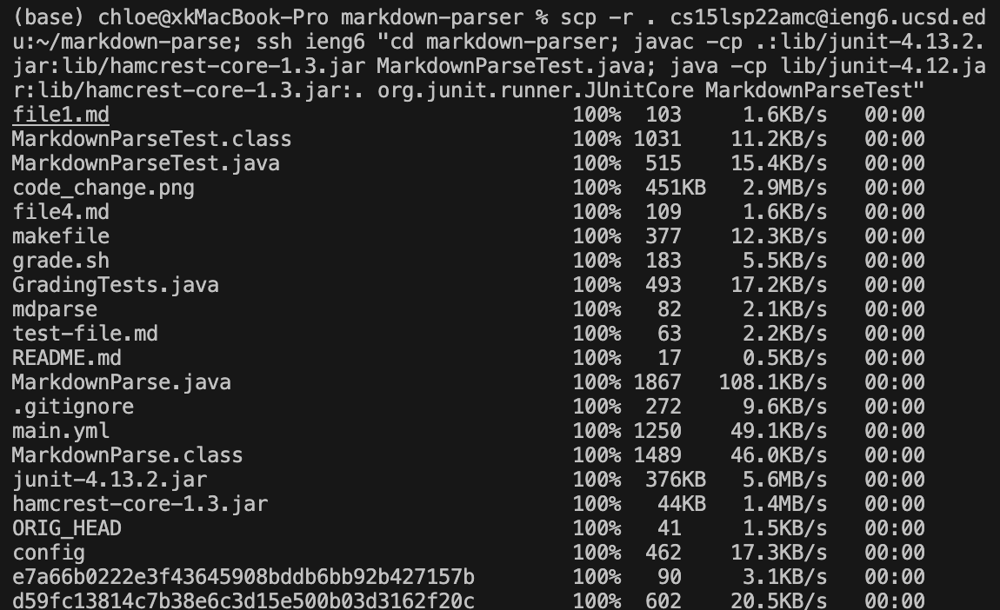

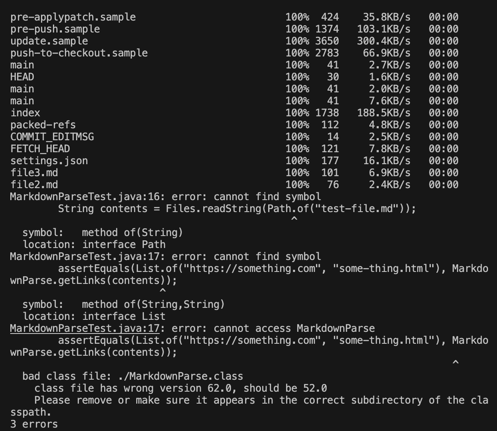
