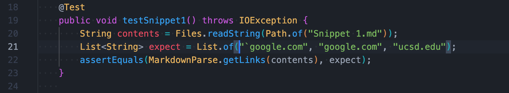

This is the [link](https://github.com/kec020/markdown-parser) to my markdown-parse repository.

This is the [link](https://github.com/hahacen/markdown-parser) to the one I reviewed in week 7.

# Snippet 1

By looking at the VScode preview, 
the expected output should be <code>[`google.com, google.com, ucsd.edu]</code>

This is my code in MarkdownParseTest.java for how I turned it into a test

The corresponding output when running the test:

For my implementation: Failed

For the implementation you reviewed in Week 7: Failed

# Snippet 2
By looking at the VScode preview, 
the expected output should be <code>[a.com, a.com(()), example.com]</code>

This is my code in MarkdownParseTest.java for how I turned it into a test

The corresponding output when running the test:

For my implementation: Failed

For the implementation you reviewed in Week 7: Failed

# Snippet 3
By looking at the VScode preview, 
the expected output should be <code>[https://www.twitter.com, https://sites.google.com/eng.ucsd.edu/cse-15l-spring-2022/schedule, https://cse.ucsd.edu/]</code>

This is my code in MarkdownParseTest.java for how I turned it into a test

The corresponding output when running the test:

For my implementation: Failed

For the implementation you reviewed in Week 7: Failed

