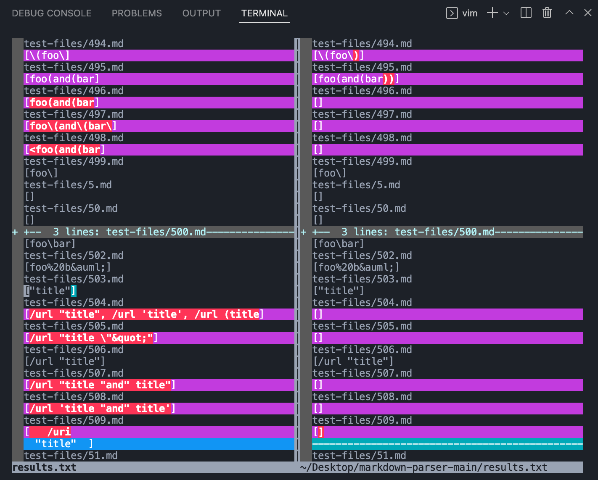
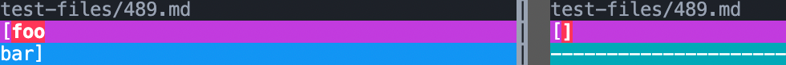
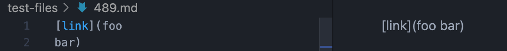
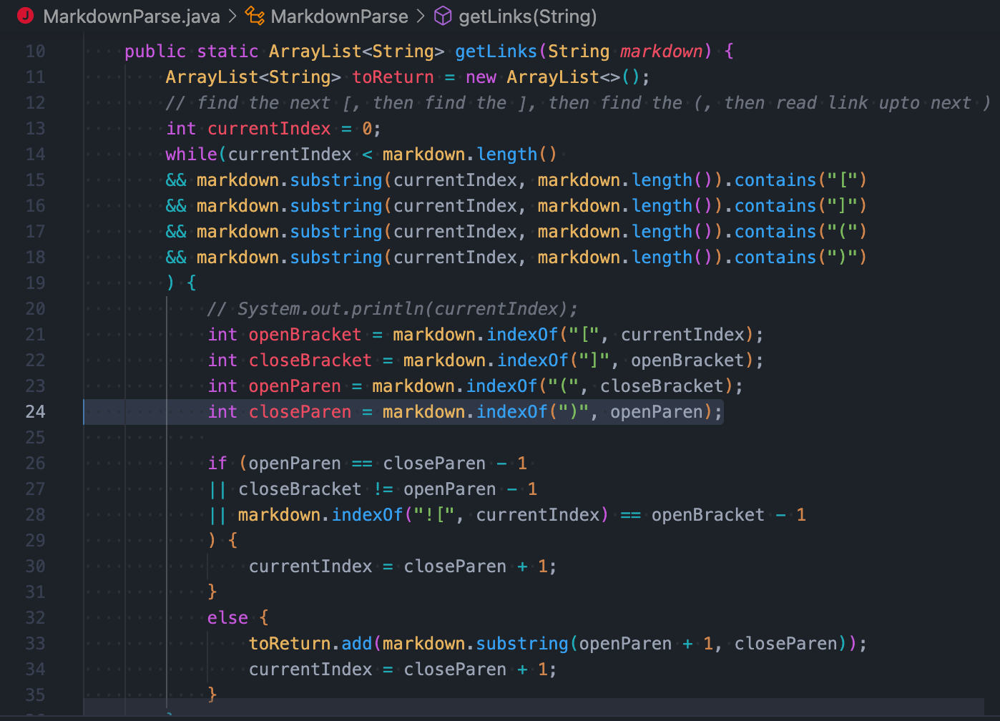
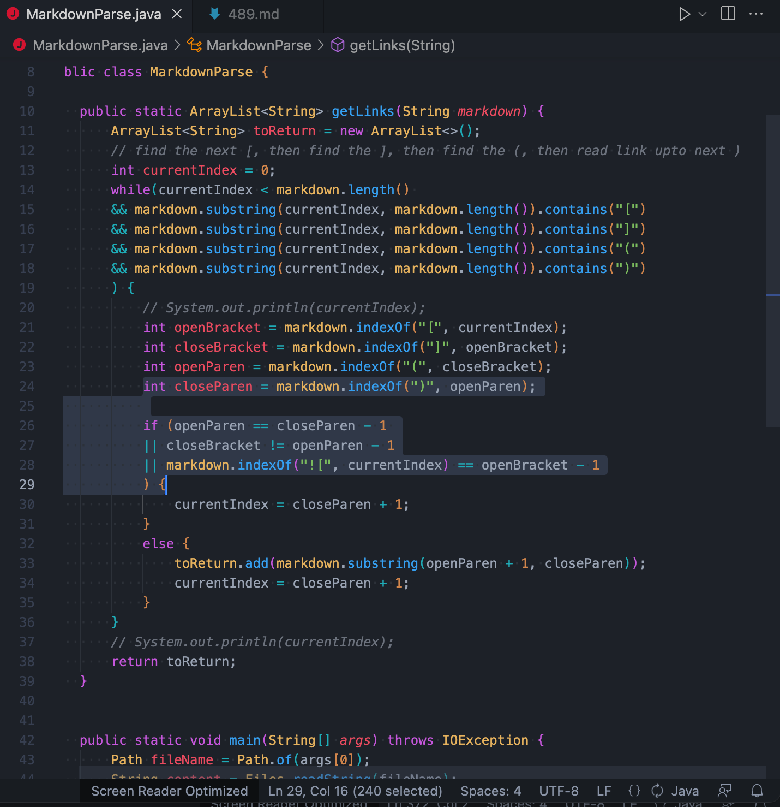

# Task 1

How you found the tests with different results (Did you use vimdiff on the results 
of running a bash for loop? Did you search through manually? Did you use some other 
programmatic idea?)

I first used `bash script.sh > xxx.txt` to store the results for the two implementations
in two files (xxx stands for the name of the two files I created)

Then I found the tests with different results by using `vimdiff` command

Here is what the `vimdiff` shows:

# Task 2

Provide a link to the test-file with different-results (in the provided repository or 
your repository , either is fine)

Here is the link for the first test: [495.html.test](https://github.com/kec020/markdown-parser/blob/main/test-files/495.html.test), [495.md](https://github.com/kec020/markdown-parser/blob/main/test-files/495.md)

Here is the link for the second test: [489.html.test](https://github.com/kec020/markdown-parser/blob/main/test-files/489.html.test), [489.md](https://github.com/kec020/markdown-parser/blob/main/test-files/489.md)

# Task 3

For each test:

- Describe which implementation is correct, or neither if both give the wrong output

For the first test, the implementation provided for lab 9 is correct, and my implementation 
gives the wrong output.

For the second test, the implementationprovided for lab 9 is correct, and my implementation 
gives the wrong output.

- Indicate both actual outputs (provide screenshots) and also what the expected output 
is (list the links that are expected in the output).

For the first test 495:

This is the actual output:

The expected output should be *[foo(and(bar))]*

For the second test 494:

This is the actual output:

The expected output should be *[foo(and(bar))]*

# Task 4
For the implementation that’s not correct (or choose one if both are incorrect), 
describe the bug (the problem in the code) in about 2-3 sentences. You don’t have to 
provide a fix, but you should be specific about what is wrong with the program, and 
show the code that should be fixed (Provide a screenshot of code and highlight where 
the change needs to be made).

For the first test 495:

In my implementation, I didn't consider the situation when there are parentheses 
inside the parentheses. It will just find the index of the first ")" after the "(".
To fix it, I need to update the index of the close parenthesis ")" when there is "(" 
inside the parentheses.

The index of ")" should be updated after "(" shows up

For the second test 489:

In my implementation, I did not consider the situation when there is a newline inside
the parentheses. It just keeps finding the next ")". To fix it, I think I can find the 
index of `/n` after finding the index of closeParen. If the index of `/n` is smaller than
the index of closeParen, then update the index of closeParen to be the index of `/n`. Also,
add another condition that the index of closeParen is equal to the index of `/n` using `||` inside the if statement: 

Here is the highlighted part I think the code needed to be changed.
